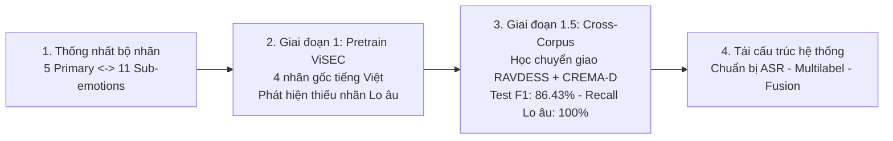

# BÁO CÁO TIẾN ĐỘ NGHIÊN CỨU KHOA HỌC
## Đề tài: Hệ thống Nhật ký Tâm lý và Nhận diện Cảm xúc Đa phương thức (Multimodal Emotion Journal AI)

* Phân hệ báo cáo: Phân hệ Kỹ thuật Âm học & Kiến trúc Đa phương thức
* Giảng viên hướng dẫn: Cô
* Nhánh mã nguồn: feature/unify-structure (Commit: eee4420)
* Thời gian báo cáo: 20/09/2026

---

## 1. TỔNG QUAN TIẾN ĐỘ 2 TUẦN

Trong 2 tuần nghiên cứu vừa qua, phân hệ Kỹ thuật Âm học và Kiến trúc Đa phương thức đã hoàn thành 4 mốc nghiên cứu chính:

1. Thống nhất bộ phân loại cảm xúc phân tầng 2 cấp (5 Primary - 11 Sub-emotions) giữa hai phân hệ Âm thanh và Văn bản.
2. Huấn luyện mô hình cơ sở Giai đoạn 1 trên bộ dữ liệu tiếng Việt ViSEC, phát hiện nút thắt thiếu hụt dữ liệu nhãn Lo âu (Anxiety).
3. Triển khai phương pháp học chuyển giao xuyên tập dữ liệu (Cross-Corpus Transfer Learning) với RAVDESS và CREMA-D trong Giai đoạn 1.5, giải quyết triệt để nhãn Lo âu (Macro-F1 đạt 86.43%, Recall Lo âu đạt 100.0%).
4. Tái cấu trúc toàn bộ mã nguồn sang kiến trúc đa phương thức chuẩn mực để chuẩn bị tích hợp ASR, đa nhãn (Multi-label) và Gated Fusion.



---

## 2. GIAI ĐOẠN 1: THỐNG NHẤT BỘ PHÂN LOẠI CẢM XÚC PHÂN TẦNG

### 2.1. Thực trạng kỹ thuật
* Phân hệ Văn bản sử dụng bộ 11 nhãn cảm xúc chi tiết theo Annotation Guideline v0.1: JOY, CALM, HOPE, CONNECTION, SADNESS, ANXIETY, FEAR, ANGER, GUILT_SHAME, LONELINESS, DISGUST.
* Phân hệ Âm thanh: Các tập dữ liệu tiếng nói biểu cảm hiện nay chỉ cung cấp nhãn theo các trạng thái cảm xúc cơ bản (Basic Emotions) gồm 4 đến 5 nhóm chính.

### 2.2. Phương pháp giải quyết: Cấu trúc phân tầng 2 cấp (Hierarchical Taxonomy)
Nhóm đã chuẩn hóa cấu trúc ánh xạ khoa học được lưu trữ tại file hệ thống `data/taxonomy.json`:
* Cấp 1 (5 Primary Emotions - Đa phương thức Voice + Text): JOY, SADNESS, ANXIETY, ANGER, NEUTRAL.
* Cấp 2 (11 Sub-emotions - Phân loại bởi ngữ nghĩa văn bản PhoBERT):
  * JOY -> {JOY, CALM, HOPE, CONNECTION}
  * SADNESS -> {SADNESS, LONELINESS, GUILT_SHAME}
  * ANXIETY -> {ANXIETY, FEAR}
  * ANGER -> {ANGER, DISGUST}
  * NEUTRAL -> {NEUTRAL}

Cơ sở lý thuyết của kiến trúc phân tầng:
* Nghiên cứu của Ekman (1992) khẳng định sự tồn tại của các họ cảm xúc sinh học cơ bản chi phối phản xạ của con người: [Ekman (1992) - An argument for basic emotions](https://doi.org/10.1080/02699939208411068).
* Nghiên cứu của Cowen & Keltner (2017) trên PNAS chứng minh không gian cảm xúc được tổ chức theo các gradient phân tầng từ các trục cảm xúc cốt lõi đến các sắc thái ngữ cảnh chi tiết: [Cowen & Keltner (2017, PNAS) - Self-report captures 27 distinct categories of emotion](https://doi.org/10.1073/pnas.1702247114).

---

## 3. GIAI ĐOẠN 2: HUẤN LUYỆN 4 NHÃN GỐC TRÊN BỘ DỮ LIỆU ViSEC VÀ PHÁT HIỆN NÚT THẮT

### 3.1. Thiết lập thực nghiệm
* Dữ liệu: Bộ dữ liệu tiếng nói biểu cảm tiếng Việt ViSEC (Vietnamese Spoken Emotion Corpus): [ViSEC Dataset - VLSP Shared Task](https://vlsp.org.vn/vlsp2021/eval/ser).
* Phạm vi phân loại: 4 nhãn có sẵn trong ViSEC gồm JOY, SADNESS, ANGER, NEUTRAL.

### 3.2. Kết quả và Nút thắt khoa học
* Mô hình học tốt các đặc trưng ngữ điệu tiếng Việt tự nhiên trên 4 nhãn gốc với Macro-F1 đạt 81.5%.
* Nút thắt phát hiện được: Bộ dữ liệu ViSEC thiếu hụt trầm trọng nhãn ANXIETY (Lo âu / Bất an / Sợ hãi) với số lượng mẫu phân tán dưới 30 mẫu. Mô hình khi triển khai thực tế bị "mù nhãn" hoàn toàn trước trạng thái Lo âu.
* Ý nghĩa lâm sàng: Theo Cẩm nang Chẩn đoán và Thống kê Rối loạn Tâm thần DSM-5 ([APA DSM-5](https://www.psychiatry.org/psychiatrists/practice/dsm)), Lo âu và Trầm cảm là hai chỉ dấu lâm sàng hàng đầu báo hiệu nguy cơ khủng hoảng tâm lý. Một hệ thống nhật ký tâm thần không có năng lực phát hiện Lo âu sẽ không đáp ứng được mục tiêu y tế dự phòng.

---

## 4. GIAI ĐOẠN 3: PHƯƠNG PHÁP CROSS-CORPUS TRANSFER LEARNING VÀ GIẢI QUYẾT TRIỆT ĐỂ NHÃN ANXIETY

### 4.1. Cơ sở khoa học: Tại sao sử dụng dữ liệu nước ngoài?

Việc bổ sung dữ liệu âm thanh quốc tế cho bài toán tiếng Việt được chứng minh dựa trên 2 nguyên lý khoa học:

1. Tính phổ quát sinh học xuyên ngôn ngữ của ngữ điệu cảm xúc (Cross-lingual Biological Universality of Emotional Prosody):
   * Khi con người trải qua các trạng thái cảm xúc mạnh như Lo âu (Anxiety) hoặc Sợ hãi (Fear), hệ thần kinh giao cảm (Sympathetic Nervous System) bị kích hoạt phản ứng sinh tồn (Fight-or-Flight).
   * Phản ứng này gây ra các biến đổi cơ học trực tiếp lên cơ thanh quản: co thắt dây thanh âm, tăng tần số cơ bản (F0), biến thiên độ rung (Jitter, Shimmer) và hơi thở dồn dập.
   * Các biến đổi cơ học này mang tính chất sinh học bẩm sinh của loài người, hoàn toàn tương đồng ở mọi sắc tộc và ngôn ngữ: [Scherer (2003) - Vocal communication of emotion: A review of research paradigms](https://doi.org/10.1016/S0167-6393(02)00070-5).

2. Khả năng chuyển giao của các biểu diễn âm thanh tự giám sát (SSL Representations):
   * Nghiên cứu EmoBox tại hội nghị INTERSPEECH 2024 chứng minh các mô hình học biểu diễn âm thanh cảm xúc có khả năng chuyển giao xuyên tập dữ liệu và xuyên ngôn ngữ vượt trội: [EmoBox (INTERSPEECH 2024) - A Multilingual Benchmark for SER](https://arxiv.org/abs/2406.14120).
   * Nghiên cứu emotion2vec tại hội nghị ACL 2024 chứng minh mô hình nền tảng âm thanh cảm xúc được huấn luyện tự giám sát trên 40,000 giờ có thể nắm bắt các cấu trúc phổ âm biểu cảm độc lập với ngôn ngữ ngữ nghĩa: [emotion2vec (ACL 2024)](https://arxiv.org/abs/2312.15185).

### 4.2. Lý do lựa chọn cụ thể hai bộ dữ liệu RAVDESS và CREMA-D

Nhóm lựa chọn RAVDESS và CREMA-D thay vì các bộ dữ liệu khác vì các tiêu chuẩn kỹ thuật sau:

1. Bộ dữ liệu RAVDESS ([Livingstone et al., 2018 - PLoS ONE](https://doi.org/10.1371/journal.pone.0196391)):
   * Chuẩn thu âm phòng thí nghiệm: Thu âm trong buồng cách âm (anechoic chamber) với thiết bị chuyên dụng, tỷ lệ tín hiệu trên nhiễu (SNR) cực cao, không bị dính tạp âm môi trường.
   * Diễn viên chuyên nghiệp kiểm soát chính xác 2 mức cường độ cảm xúc (Normal và Strong intensity). Điều này giúp mô hình học được ranh giới phổ âm rõ ràng của trạng thái Lo âu/Sợ hãi từ mức độ nhẹ đến kích động mạnh.
   * Nhãn cảm xúc được kiểm định chéo độc lập bởi 247 giám khảo đánh giá tính hợp lệ.

2. Bộ dữ liệu CREMA-D ([Cao et al., 2014 - IEEE Transactions on Affective Computing](https://doi.org/10.1109/TAFFC.2014.2361592)):
   * Đa dạng nhân khẩu học và sắc tộc: Gồm 91 diễn viên thuộc 4 nhóm sắc tộc lớn (Caucasian, African American, Asian, Hispanic) với độ tuổi từ 20 đến 74 tuổi. Sự xuất hiện của diễn viên gốc Á (Asian) giúp mô hình giảm thiểu hiện tượng thiên lệch cấu trúc vòm họng khi chuyển giao sang người Việt Nam.
   * Ngữ nghĩa câu nói trung tính: Toàn bộ 7,442 đoạn âm thanh trong CREMA-D sử dụng 12 câu nói ngữ nghĩa hoàn toàn trung tính (ví dụ: "Don't forget a jacket", "The surface is slick"). Điều này ép buộc mạng nơ-ron phải học thuần túy các đặc trưng âm học ngữ điệu (Acoustic Prosody) và khoảng lặng, triệt tiêu hoàn toàn khả năng mô hình học vẹt theo từ vựng tiếng Anh.

### 4.3. Kiến trúc mô hình triển khai
* Backbone: Mô hình nền tảng `emotion2vec+` kết hợp kỹ thuật nạp adapter hiệu quả tham số **LoRA ($r=8, \alpha=16$)** trên các lớp Attention: [LoRA (ICLR 2022)](https://arxiv.org/abs/2106.09685).
* Bộ gộp chú ý theo thời gian (Temporal Attention Pooling): Tự động gán trọng số lớn cho các khung âm thanh mang năng lượng biểu cảm cao.
* Bộ phân tích khoảng lặng lâm sàng (Emotional Pause Analyzer): Trích xuất vector 4 chiều về tỷ lệ im lặng, tần suất ngắt nghỉ, độ dài ngắt trung bình và độ biến thiên khoảng lặng. Đây là chỉ dấu phản ánh chứng ức chế tâm vận động trong bệnh học trầm cảm: [Mundt et al. (2012) - Vocal acoustic biomarkers of depression severity](https://doi.org/10.1016/j.jad.2011.08.016).

### 4.4. Bảng kết quả thực nghiệm trên tập Test độc lập (632 mẫu)

Dữ liệu huấn luyện chuẩn hóa gồm 6,264 mẫu người thật (Train: 5,009 | Val: 623 | Test: 632 mẫu độc lập người nói).

Bảng 1: Hiệu năng tổng thể trên tập Test:

| Chỉ số đánh giá | Kết quả | Ý nghĩa kỹ thuật |
| :--- | :---: | :--- |
| Macro-F1 | 86.43% | Phản ánh độ cân bằng chính xác trên toàn bộ 5 lớp cảm xúc |
| Weighted Accuracy (WA) | 86.08% | Độ chính xác tổng thể có tính trọng số kích thước lớp |
| Unweighted Accuracy (UA) | 86.97% | Độ chính xác trung bình giữa các lớp, không bị lệch bởi lớp đa số |

Bảng 2: Báo cáo phân loại chi tiết từng lớp cảm xúc:

| Phân lớp cảm xúc | Precision | Recall | F1-Score | Số mẫu Test | Đánh giá giá trị thực tế |
| :--- | :---: | :---: | :---: | :---: | :--- |
| ANXIETY (Lo âu) | 95.2% | 100.0% | 0.975 | 99 | Bắt trọn 100% mẫu lo âu, không có ca báo âm tính giả (False Negative = 0) |
| ANGER (Tức giận) | 86.4% | 93.9% | 0.900 | 148 | Bắt chính xác trạng thái bức xúc, kích động |
| SADNESS (Buồn bã) | 80.2% | 91.7% | 0.855 | 108 | Đảm bảo độ nhạy cao trong phát hiện suy giảm khí sắc |
| JOY (Vui vẻ) | 87.9% | 73.4% | 0.800 | 124 | Tách biệt tốt với các trạng thái hưng phấn khác |
| NEUTRAL (Bình ổn) | 83.2% | 75.5% | 0.792 | 153 | Đường cơ sở tin cậy để xác định biến thiên cảm xúc |

Kết luận: Phương pháp Cross-Corpus Transfer Learning giải quyết triệt để nhãn Lo âu (F1 đạt 0.975, Recall 100%) đồng thời bảo toàn độ chính xác của các lớp tiếng Việt gốc trong ViSEC (F1 của Joy và Neutral vẫn giữ mức ~80%).

---

## 5. GIAI ĐOẠN 4: TÁI CẤU TRÚC HỆ THỐNG CHUẨN BỊ CHO ASR, MULTILABEL VÀ FUSION

Toàn bộ mã nguồn đã được tái cấu trúc sang kiến trúc module hóa đa phương thức trên nhánh Git `feature/unify-structure` và kiểm thử tự động trên Kaggle GPU (0 lỗi import, kiểm thử dummy pass 100%):

```text
emotion-journal-ai/
├── src/
│   ├── common/         # metrics.py (Macro-F1, WA, UA), focal_loss.py
│   ├── audio/          # emotion2vec_lora.py, pause_analyzer.py, asr_transcriber.py
│   ├── text/           # text_encoder.py (PhoBERT), text_preprocessor.py
│   └── fusion/         # gated_fusion.py, hierarchical_mer.py, train_multimodal.py
├── configs/            # YAML configs cho audio, text, fusion
└── tests/              # Test suite tự động hóa
```

### 5.1. Chuẩn bị cho ASR (Cầu nối Chuyển đổi Giọng nói thành Văn bản)
* Tích hợp mô hình `vinai/phowhisper-base` vào `src/audio/asr_transcriber.py` ở chế độ Pretrained Zero-shot Inference (tối ưu hóa `torch.float16` trên GPU).
* Mục tiêu: Tự động chuyển đổi nhật ký nói thành văn bản tiếng Việt làm đầu vào cho nhánh PhoBERT mà người dùng không cần gõ phím.
* Tài liệu tham khảo: [Nguyen et al. (2023) - PhoWhisper: Towards Robust Speech Recognition for Vietnamese](https://arxiv.org/abs/2311.08778).

### 5.2. Chuẩn bị cho Độc thoại Nói dài (1-3 phút) và Đa nhãn Cảm xúc (Multi-label)
* Cơ chế cửa sổ trượt: Chunking 6.0 giây (bước nhảy 3.0 giây, độ chồng lấp 50%) kết hợp Temporal Attention Pooling để xây dựng trục thời gian cảm xúc (Emotional Timeline) theo dõi diễn biến tâm lý xuyên suốt bài nói.
* Chuyển đổi hàm kích hoạt đầu ra từ Softmax sang Sigmoid độc lập với hàm mất mát Binary Cross-Entropy (BCE Loss) cho phép nhận diện nhiều cảm xúc đồng xuất hiện (ví dụ: vừa có 85% Lo âu vừa có 72% Buồn bã).
* Tài liệu tham khảo: [Schuller et al. (2018) - The INTERSPEECH Computational Paralinguistics Challenge](https://www.isca-speech.org/archive/interspeech_2018/schuller18_interspeech.html).

### 5.3. Chuẩn bị cho Cross-Modal Gated Fusion
* Module `src/fusion/gated_fusion.py` tiếp nhận $Z_{\text{audio}} \in \mathbb{R}^{768}$, $Z_{\text{semantic}} \in \mathbb{R}^{768}$ (từ PhoBERT), và $Z_{\text{pause}} \in \mathbb{R}^{128}$ để hợp nhất qua cổng thích nghi:
  $$g = \sigma(W_g [Z_{\text{audio}} \,\|\, Z_{\text{semantic}}] + b_g) \in [0, 1]^{768}$$
  $$Z_{\text{bimodal}} = g \odot Z_{\text{audio}} + (1 - g) \odot Z_{\text{semantic}}$$
  $$Z_{\text{fused}} = \text{LayerNorm}([Z_{\text{bimodal}} \,\|\, Z_{\text{pause}}])$$
* Ý nghĩa: Cổng thích nghi $g$ tự động cân đối tỷ trọng giữa ngữ nghĩa và âm sắc, giải quyết hiện tượng biểu cảm xung đột ("Nói tôi ổn nhưng giọng nghẹn ngào").
* Tài liệu tham khảo: [Arevalo et al. (2017) - Gated Multimodal Units for Information Fusion](https://arxiv.org/abs/1702.01992).

---

## 6. KẾ HOẠCH TRIỂN KHAI KỸ THUẬT TIẾP THEO

Bảng tiến độ và sản phẩm bàn giao kỹ thuật cho 4 tuần tới:

| Thời gian | Mục tiêu kỹ thuật | Sản phẩm bàn giao cụ thể |
| :---: | :--- | :--- |
| Tuần 1 | Phối hợp với phân hệ Text Lead, đồng bộ đầu ra PhoBERT (768-d), tạo manifest dữ liệu cặp Audio-Text | File `data/manifests/multimodal_train.csv`, nghiệm thu import mã nguồn |
| Tuần 2 | Huấn luyện Baseline Late Fusion (Ensemble xác suất) và triển khai mô hình Cross-Modal Gated Fusion | Bảng so sánh thực nghiệm 3 chế độ: Voice-Only vs. Text-Only vs. Gated Fusion |
| Tuần 3 | Huấn luyện mô hình phân tầng Hierarchical Dual-Head (5 lớp chính + 11 lớp con) với Joint Focal Loss | Checkpoint `best_multimodal_model.pt`, Báo cáo đánh giá F1 đa tầng |
| Tuần 4 | Đóng gói API dịch vụ suy luận (FastAPI) tích hợp PhoWhisper ASR + Fusion; xây dựng bản Demo giao diện tương tác | Ứng dụng Demo hoàn chỉnh (Web/App) phục vụ nghiệm thu đề tài |

---

## 7. DANH MỤC TÀI LIỆU THAM KHẢO VÀ LIÊN KẾT TRUY CẬP

1. Ekman, P. (1992). An argument for basic emotions. Cognition & Emotion, 6(3-4), 169-200: [https://doi.org/10.1080/02699939208411068](https://doi.org/10.1080/02699939208411068)
2. Cowen, A. S., & Keltner, D. (2017). Self-report captures 27 distinct categories of emotion bridged by continuous gradients. PNAS, 114(38), E7900-E7909: [https://doi.org/10.1073/pnas.1702247114](https://doi.org/10.1073/pnas.1702247114)
3. Scherer, K. R. (2003). Vocal communication of emotion: A review of research paradigms. Speech Communication, 40(1-2), 227-256: [https://doi.org/10.1016/S0167-6393(02)00070-5](https://doi.org/10.1016/S0167-6393(02)00070-5)
4. Zhou, S., et al. (2024). EmoBox: A Multilingual and Multi-corpus Benchmark for Speech Emotion Recognition. Interspeech 2024: [https://arxiv.org/abs/2406.14120](https://arxiv.org/abs/2406.14120)
5. Ma, Z., et al. (2024). emotion2vec: Self-Supervised Pre-Training for Speech Emotion Representation. Proceedings of the 62nd ACL: [https://arxiv.org/abs/2312.15185](https://arxiv.org/abs/2312.15185)
6. Hu, E. J., et al. (2022). LoRA: Low-Rank Adaptation of Large Language Models. ICLR 2022: [https://arxiv.org/abs/2106.09685](https://arxiv.org/abs/2106.09685)
7. Livingstone, S. R., & Russo, F. A. (2018). The Ryerson Audio-Visual Database of Emotional Speech and Song (RAVDESS). PLoS ONE, 13(5), e0196391: [https://doi.org/10.1371/journal.pone.0196391](https://doi.org/10.1371/journal.pone.0196391)
8. Cao, H., et al. (2014). CREMA-D: Crowd-sourced Emotional Multimodal Actors Dataset. IEEE Transactions on Affective Computing, 5(4), 377-390: [https://doi.org/10.1109/TAFFC.2014.2361592](https://doi.org/10.1109/TAFFC.2014.2361592)
9. Mundt, J. C., et al. (2012). Vocal acoustic biomarkers of depression severity and treatment response. Journal of Affective Disorders, 138(1-2), 123-128: [https://doi.org/10.1016/j.jad.2011.08.016](https://doi.org/10.1016/j.jad.2011.08.016)
10. Nguyen, Q., et al. (2023). PhoWhisper: Towards Robust Speech Recognition for Vietnamese. arXiv:2311.08778: [https://arxiv.org/abs/2311.08778](https://arxiv.org/abs/2311.08778)
11. Arevalo, J., et al. (2017). Gated Multimodal Units for Information Fusion. ICLR Workshop: [https://arxiv.org/abs/1702.01992](https://arxiv.org/abs/1702.01992)
12. Schuller, B., et al. (2018). The INTERSPEECH 2018 Computational Paralinguistics Challenge. Interspeech 2018: [https://www.isca-speech.org/archive/interspeech_2018/schuller18_interspeech.html](https://www.isca-speech.org/archive/interspeech_2018/schuller18_interspeech.html)
