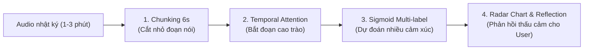

# KẾ HOẠCH HÀNH ĐỘNG STAGE 2 & TỔNG HỢP GIẢI PHÁP KỸ THUẬT
## Dự án: Nhật ký Sức khỏe Tinh thần & Nhận diện Cảm xúc Đa phương thức (Emotion Journal AI)

---

## 📌 PHẦN 1: BẢNG TỔNG QUAN VẤN ĐỀ & GIẢI PHÁP (PROBLEM-SOLUTION MATRIX)

| STT | Vấn đề đặt ra | Thách thức thực tế | Giải pháp kỹ thuật & Kiến trúc |
| :---: | :--- | :--- | :--- |
| **1** | **Refactor thư mục dự án** | Tránh xung đột code, đảm bảo tính mô-đun hóa khi 2 người cùng ghép nhánh. | Tái cấu trúc theo chuẩn `src/common`, `src/text`, `src/audio`, `src/fusion`; bảo toàn toàn bộ pipeline SOTA `emotion2vec` + LoRA. |
| **2** | **Kiểm chứng ASR (Speech-to-Text)** | Code ASR mới được dàn dựng, chưa chạy thực tế với file âm thanh tiếng Việt thật. | Đã vá chuẩn `float16` GPU; chạy test thực địa đối chiếu với transcript ViSEC; sử dụng chế độ Pretrained Inference (không cần train lại). |
| **3** | **Nhãn mới & Phân tầng nhãn (Hierarchical)** | Dữ liệu âm thanh chỉ có 5 nhãn chính, làm sao ra được 11 nhãn con theo Guideline? | Thiết kế **Dual Classification Heads**: Head 1 (Primary - 5 nhãn) dựa trên $Z_{\text{fused}}$; Head 2 (Sub-category - 11 nhãn) dựa trên $Z_{\text{semantic}}$ từ PhoBERT. |
| **4** | **Đa nhãn & Độc thoại dài (Multi-label)** | Nhật ký là đoạn nói dài 1–3 phút, chứa nhiều cảm xúc pha trộn và thay đổi theo thời gian. | **Chunking 6s** + **Temporal Attention Pooling** (vẽ Emotional Timeline) + Chuyển tầng phân loại sang **Sigmoid (Binary Cross-Entropy)** cho phép đa nhãn. |

---

## 🛠️ PHẦN 2: CHI TIẾT CÁC GIẢI PHÁP KỸ THUẬT

### 1. Tái Cấu Trúc Thư Mục Chuẩn Mực (Directory Refactoring)
* **Thời điểm thực hiện:** Ngay bây giờ, trên branch riêng `refactor/unify-structure`.
* **Cây thư mục tối ưu:**
  ```text
  mental-health-emotion-journal/
  ├── requirements/
  │   ├── base.txt                 # torch, numpy, scikit-learn
  │   ├── text.txt                 # transformers, pyvi, underthesea
  │   └── audio.txt                # funasr, modelscope, torchaudio, soundfile
  ├── data/
  │   ├── taxonomy.json            # Ánh xạ chuẩn 5 Primary -> 11 Sub-labels
  │   └── manifests/               # Metadata CSV cho Text, Audio, Multimodal
  ├── scripts/
  │   ├── prepare_crosscorpus.py   # Chuẩn bị dữ liệu âm thanh đa ngữ
  │   └── verify_asr.py            # Kiểm thử tự động PhoWhisper ASR
  ├── src/
  │   ├── common/                  # [DÙNG CHUNG] metrics.py (WA, UA, Macro-F1), losses.py (FocalLoss)
  │   ├── text/                    # [TEXT LEAD] preprocessing, dataset, text_encoder (PhoBERT)
  │   ├── audio/                   # [AUDIO LEAD] emotion2vec_lora, attention_pooling, pause_analyzer, asr
  │   └── fusion/                  # [MULTIMODAL] gated_fusion, hierarchical_mer, late_fusion
  ├── configs/                     # YAML cấu hình riêng cho Text, Audio, Fusion
  └── checkpoints/                 # (Gitignored) Chứa file .pt đã huấn luyện
  ```

---

### 2. Vận Hành & Kiểm Chứng ASR (PhoWhisper-base)
* **Bản chất mô hình:** Sử dụng `vinai/phowhisper-base` của VinAI Research. Mô hình đã được huấn luyện sẵn trên hàng chục nghìn giờ tiếng Việt $\rightarrow$ **Không cần huấn luyện lại**, chỉ gọi suy luận zero-shot (`inference`).
* **Đã vá lỗi kỹ thuật trong `asr_transcriber.py`:** Tự động đồng bộ kiểu dữ liệu `input_features` theo `self.model.dtype` (`torch.float16` trên GPU T4) để tránh lỗi kiểu tensor.
* **Quy trình kiểm chứng độc lập:**
  ```python
  # Chạy thử nghiệm trên file ViSEC thật để đối chiếu Ground Truth vs PhoWhisper
  asr = PhoWhisperTranscriber(model_id="vinai/phowhisper-base", device="cuda")
  asr.load_model()
  result = asr.transcribe("sample_visec.wav")
  print("Thực tế nói :", ground_truth_transcript)
  print("AI nhận diện:", result.text)
  ```

---

### 3. Giải Pháp Phân Tầng Nhãn (Hierarchical Emotion Taxonomy)
* **Quy luật sinh học âm thanh:** Âm thanh người thật chỉ đủ biểu hiện 5 cảm xúc sinh học cơ bản (`JOY`, `SADNESS`, `ANXIETY`, `ANGER`, `NEUTRAL`). Các cảm xúc vi tế như *Cô đơn, Tội lỗi, Hy vọng* phụ thuộc 90% vào ngữ nghĩa văn bản.
* **Cơ chế Dual Heads (Stage 2):**
  1. **Primary Head (Level 1 - 5 Lớp):** Nhận diện cảm xúc tổng quát từ vector $Z_{\text{fused}} \in \mathbb{R}^{896}$ (kết hợp cả Âm thanh + Ngữ nghĩa + Khoảng lặng).
  2. **Sub-category Head (Level 2 - 11 Lớp):** Nhận diện sắc thái tinh tế từ vector $Z_{\text{semantic}} \in \mathbb{R}^{768}$ của PhoBERT.
* **Ánh xạ nhãn `ANXIETY`:**
  $$\text{Level 1: ANXIETY} \longleftarrow \begin{cases} \text{Level 2: ANXIETY (Lo âu bồn chồn mơ hồ)} \\ \text{Level 2: FEAR (Sợ hãi trước mối đe dọa cụ thể)} \end{cases}$$

---

### 4. Giải Pháp Cho Độc Thoại Dài & Cảm Xúc Đa Nhãn (Multi-Label Journaling)
Một bài nhật ký 1–3 phút luôn có nhiều cung bậc cảm xúc đan xen. Hệ thống xử lý thông qua 3 trụ cột:



1. **Trụ cột 1: Chunking 6s & Temporal Attention Pooling:**
   - Chia đoạn nói thành các chunk 6 giây (độ đè 50%).
   - Attention Weights $\alpha_i$ tự động xác định câu nào là cao trào cảm xúc nhất.
   - Hỗ trợ tính năng **Emotional Timeline** (vẽ đồ thị biến thiên cảm xúc từ đầu đến cuối bài nhật ký).
2. **Trụ cột 2: Chuyển đổi từ Softmax sang Sigmoid (Multi-label Classification):**
   - Thay vì ép tổng xác suất $\sum P = 1$ (chỉ được chọn 1 cảm xúc duy nhất):
     $$P(\text{Emotion } c) = \sigma(z_c) \in [0, 1]$$
   - Mọi cảm xúc vượt ngưỡng ngưỡng cắt (ví dụ: $\ge 0.5$) đều được ghi nhận (ví dụ: đồng thời phát hiện `ANXIETY` 85% và `SADNESS` 72%).
3. **Trụ cột 3: Trải nghiệm người dùng (Product UX):**
   - Ứng dụng hiển thị **Phổ cảm xúc (Radar Chart)** thay vì phán xét 1 từ cứng nhắc.
   - AI đóng vai trò người lắng nghe thấu cảm, phản hồi trúng trạng thái tâm lý phức tạp của người dùng.

---

## 📅 PHẦN 3: KẾ HOẠCH HÀNH ĐỘNG CHI TIẾT (STAGE 2 ACTION PLAN)

### 🗓️ Tuần 1: Chuẩn Hóa Kiến Trúc & Dữ Liệu
* **Ngày 1 (Hôm nay):** Họp 1-1 với Text Lead, chốt cấu trúc thư mục thống nhất và nghiệm thu kết quả Stage 1.5 (Voice Test Macro-F1 = 86.43%).
* **Ngày 2:** Tạo branch `refactor/unify-structure`, di chuyển code vào các thư mục `src/common`, `src/audio`, `src/text`, `src/fusion`; đảm bảo unit test chạy thông suốt.
* **Ngày 3:** Chạy script kiểm chứng PhoWhisper ASR trên tập ViSEC, đóng gói hàm `asr.transcribe()` làm API cung cấp text cho Text Lead.
* **Ngày 4:** Tạo tập dữ liệu cặp (Paired Multimodal Dataset) chứa cả file âm thanh và transcript tiếng Việt.

### 🗓️ Tuần 2: Huấn Luyện & Đánh Giá Đa Phương Thức (Stage 2)
* **Ngày 5:** Xây dựng Baseline nhanh: **Late Fusion (Ensemble)** bằng cách cộng xác suất Softmax giữa Voice model và Text model.
* **Ngày 6:** Huấn luyện mô hình chính: **Cross-Modal Gated Fusion** (`HierarchicalMERModel`) với hàm kích hoạt Sigmoid đa nhãn.
* **Ngày 7:** Lập bảng nghiên cứu triệt tiêu (**Ablation Study**) so sánh: Text-only vs Voice-only vs Late Fusion vs Gated Fusion.
* **Ngày 8:** Thu âm 20–30 đoạn nhật ký tiếng Việt thực tế từ thành viên trong nhóm làm tập kiểm thử thực địa (**Vietnamese Pilot Test**) để demo trước Giảng viên.

---

## 💬 PHẦN 4: KỊCH BẢN TRẢ LỜI CÂU HỎI KHI BẢO VỆ TIẾN ĐỘ VỚI CÔ

#### ❓ Câu hỏi 1: *"Hệ thống xử lý thế nào khi người dùng nói một bài nhật ký dài có nhiều cảm xúc khác nhau?"*
> **Trả lời:** *"Thưa cô, chúng em không nén phẳng cả bài nói mà áp dụng cơ chế **Chunking 6 giây** kết hợp **Temporal Attention Pooling**. Mô hình tự động học được trọng số chú ý để phát hiện phân đoạn nào là cao trào cảm xúc nhất trong bài nói. Đồng thời, ở tầng phân loại, chúng em chuyển sang cơ chế **Multi-label (Sigmoid)** để mô hình có thể phát hiện đồng thời nhiều cảm xúc cùng lúc (ví dụ: vừa lo âu vừa buồn bã) và biểu diễn thành phổ cảm xúc cho người dùng."*

#### ❓ Câu hỏi 2: *"Phần Speech-to-Text (ASR) của nhóm hoạt động như thế nào và có làm suy giảm chất lượng nhận diện không?"*
> **Trả lời:** *"Thưa cô, phần ASR sử dụng mô hình chuyên biệt cho tiếng Việt là `PhoWhisper-base` của VinAI. Khi người dùng nói, ASR sẽ tự động chuyển âm thanh thành văn bản và khôi phục dấu câu chuẩn xác, sau đó nạp vào PhoBERT. Khi huấn luyện, nhóm sử dụng cơ chế Gated Fusion thích ứng: nếu chất lượng âm thanh hoặc ASR bị nhiễu, cổng Gating sẽ tự động giảm tỷ trọng của nhánh bị nhiễu và ưu tiên nhánh có tín hiệu tin cậy hơn."*
